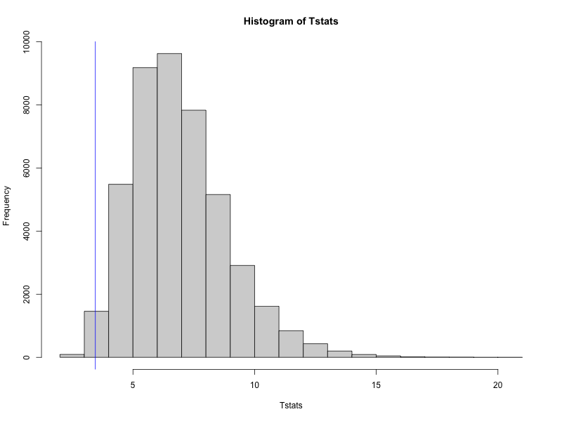
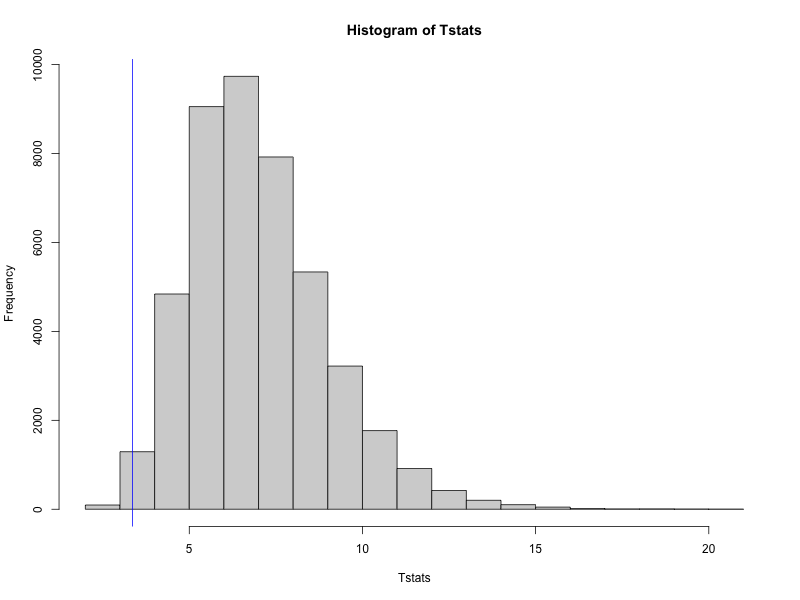
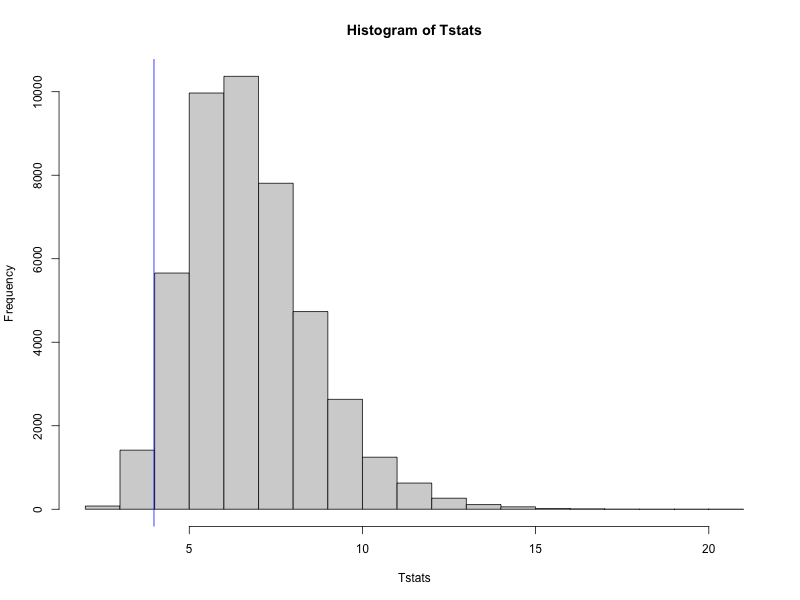

```{r,include=FALSE}

# Setup 

knitr::opts_chunk$set(message = FALSE)

set.seed(126)

library(mosaic)
library(tidyverse)
library(effects)
library(ggResidpanel)
library(catstats2)
library(Matrix)
library(KFAS)
library(rstan)
library(loo)

options(mc.cores = parallel::detectCores())

```


# Introduction

One of the most important factors contributing to race strategy in a Formula 1 grand prix is tire degradation.  In each race, there are three different dry tire compounds for teams to choose from, along with an intermediate tire and a full wet tire for rainy conditions.  The dry tires--referred to as "hard", "medium", and "soft"--are designed by Pirelli to degrade at different rates.  Softer tires provide more grip initially and allow for faster lap times.  However, they degrade faster than harder tires, which leads to slower lap times later in the stint*(define this term)*.  On the other hand, harder tires are not as quick, but degrade more slowly.  Tire degradation itself is a phenomenon which occurs as a result of the extreme forces put through the tires during a grand prix.  These forces cause shearing of the rubber from the surface of the tire and thermal degradation of the tire carcass due to friction*(citation?)*.  

Tire degradation drives an increase in lap times throughout the course of a stint.  Because of this, one can often complete the race faster by pitting for a new set of tires (often more than once).  Therefore, it is imperative to possess a thorough understanding of the degradation rates of different tire compounds to choose an optimal race strategy.  Furthermore, a model capable of estimating degradation rates would allow us to answer important strategic questions such as, "what are the degradation rates for different tire compounds?", and "how do degradation rates vary across teams?".  Moreover, such a model should allow us to predict lap times and increases in degradation rate over the course of a grand prix to inform race strategy in real time.  In pursuit of these objectives, we propose a Bayesian State Space Model.

To the best of our knowledge, there are no examples in the literature that apply state-space models to the phenomenon of tire degradation in Formula 1.  The most similar example comes from Todd et al. (2025), who use various deep learning techniques to predict tire energy over the course of a grand prix. Although the authors use explainable AI techniques to improve model interpretability, the nature of in-race decision-making is such that strategists require highly interpretable models that allow their strategies to be explained to the team.  Because of this, we believe that the explainability and flexibility of State Space models could make them an asset to F1 teams looking to gain an edge in predictive modeling.  

As we do not have access to the full range of telemetry data that an F1 team would have, our approach in this paper will be to use a discrete-time Bayesian state-space model to analyze tire degradation as the decay in lap times over the course of a grand prix for each compound used.  We will use a Bayesian workflow for model development, visualization, and comparison to allow for easier interpretation of the parameters.  Furthermore, these parameters will be directly interpretable as rates of increase in lap times due to tire degradation.  

In the remainder of this paper, we will describe the dataset and processing steps taken to obtain the time series of interest.  Then we will introduce our proposed model and interpretation of the parameters, as well as our model selection and model checking procedures.  Finally, we will answer our research questions based on degradation estimates given by our model.  

# Data Processing

The FastF1 Python API provides access to a vast array of data pertaining to each F1 grand prix.  Of interest to us are the individual lap times for each driver, what tire compound the driver used on each lap, and on what laps the driver pitted for a new set of tires.  Although there is much more available in the API, the aforementioned items will be sufficient for the scope of this paper.

 In choosing a driver's race to analyze, there were *[2]* important factors.  Firstly, we chose a race that did not have a safety car *[Background on what a safety car is?]*, as driving under safety car conditions drastically reduces degradation since the drivers are limited to much slower speeds. In future work, this model could easily be extended via indicator functions on the degradation rate to include races in which a safety car occurs. Secondly, we chose a race in which the driver of interest was minimally impeded by the drivers ahead.  If a driver gets stuck behind a slower car, this can cause an *artificial* increase in lap times that isn't due to tire degradation.  In future work, we may extend the model to be a multivariate time series that takes into account multiple drivers and the distance to the driver ahead, but for the scope of this work we will limit ourselves to a univariate time series.


Figure 1. contains a plot illustrating the time series that we have selected for analysis in this paper.  We chose *[driver]*'s *[grand prix]* because their race had minimal extraneous events(/confounding variables) that could adversely affect our inference upon latent degradation parameters.  *[After we select a race, at this point go on to talk about the driver of interest's race and explain how it meets the above considerations.  Conclude with a transition into the model specs section]*

- Talk about fuel.kg vector

```{r, echo=FALSE}

austria_laps <- read_csv("Austria_laps.csv")

austria_laps <- austria_laps %>%
    mutate(Stint = as.factor(Stint),
           Compound = as.factor(Compound))

filter(austria_laps, Driver == "HAM", is.na(PitOutTime) & is.na(PitInTime),LapTime < 100) %>%
    ggplot(mapping = aes(x = LapNumber, y = LapTime, colour = Stint)) +
    geom_point() +
    geom_smooth() +
    labs(title = "Tire Degration -- Lewis Hamilton (Ferrari)",
         x = "Lap Number",
         y = "Lap Time (Seconds)")

```


# Bayesian State Space Model

In this section we'll describe in detail the process used to model latent degradation rates through the observable lap time process.  All models were fitted using the software package Stan.

## Base Model Specification and Parameter Interpretation

We start with the observation equation for a driver's lap times:

\begin{align}
y_t &= \alpha_t + \gamma*fuel_t +\epsilon_t \\
\epsilon_t &\sim N(0,\sigma^2_\epsilon)
\end{align}

Here $y_t$ represents the observed lap time for the driver on lap $t$.  $\alpha_t$ represents the true latent pace which the tire is capable of after accounting for degradation. $fuel_t$ is a covariate that represents the amount of fuel in kilograms for the driver on lap $t$, and $\gamma$ is the estimated increase in lap time due to an additional kg of fuel.  Lastly, $\epsilon_t$ accounts for errors that would result in a lap time being different from $\alpha_t$ after accounting for fuel loss. Possible sources of this error include driver mistakes and the presence of other cars. 

Now we present the process equation:

\begin{align}
\alpha_{t+1} &= (1-I_{pit_t=1})(\alpha_t+\nu) + I_{pit_t=1}(\alpha_{reset}) + \eta_t \\
\eta_t &\sim N(0,\sigma^2_\eta)
\end{align}

where:

\begin{align}
pit_t &= 
\begin{cases}
1 & \text{if driver has a new set of tires on lap t+1} \\
0 & \text{otherwise}
\end{cases} \\
t &\in \{1, 2, ..., T\}
\end{align}

As mentioned earlier, the latent states $\alpha_t$ represent the true pace (or lap time) that the tire is capable of.  In the most basic version of the model, we consider a linear rate of decay in lap times, represented by the static parameter $\nu$ in the model.  However, we allow for error in this decay process by including the term $\eta_t$. Perhaps most interesting in the process equation is the inclusion of an indicator variable for pit stops.  These allow us to reset the degradation process to $\alpha_{reset}$ after the driver puts on a new set of tires, and then continue the degradation process as normal afterwards.

Lastly, we have the following priors:

\begin{align}
\sigma_\epsilon^2 &\sim N(.3,.1) \\
\sigma_\eta^2 &\sim N(.1,.1) \\
\nu &\sim N(0,.1) \\
\alpha_{reset} &\sim N(x,.1) \\
\end{align}


## Extensions of the Basic Model

We will propose two extensions to this basic model.  The first is to estimate different degradation rates for each tire compound, and the second is to allow the degradation rate $\nu$ to increase over time.

### Extension 1

Under the proposed first extension to the basic model, our process equation becomes:

\begin{align}
\alpha_{t+1} &= (1-I_{pit_t=1})(\alpha_t+\nu[compound_t]) + I_{pit_t=1}(\alpha_{reset}[compound_t]) + \eta_t \\
\eta_t &\sim N(0,\sigma^2_\eta)
\end{align}

where:

\begin{align}
compound_t &= 
\begin{cases}
1 & \text{if hard compound tires are used on lap t} \\
2 & \text{if medium compound tires are used on lap t} \\
3 & \text{if soft compound tires are used on lap t}
\end{cases} \\
pit_t &= 
\begin{cases}
1 & \text{if driver enters pit on the next lap} \\
0 & \text{otherwise}
\end{cases}
\end{align}

As mentioned above, the main thrust of this extension is to estimate different degradation rates and reset points for each tire compound used by the driver.  This is a natural first extension to make given that tire compounds are designed by Pirelli to degrade at different rates(citation).  

### Extension 2

Under the proposed second extension to the basic model, the process equations become: 

\begin{align}
\alpha_{t+1} &= (1-I_{pit_t=1})(\alpha_t+\nu_t) + I_{pit_t=1}(\alpha_{reset}[compound_t]) + \eta_t \\
\nu_{t+1} &= (1-I_{pit_t=1})(\nu_t + \beta[compound_t]) + I_{pit_t=1}(v_{reset}) \\
\eta_t &\sim N(0,\sigma^2_\eta)
\end{align}

where:

\begin{align}
compound_t &= 
\begin{cases}
1 & \text{if hard compound tires are used on lap t} \\
2 & \text{if medium compound tires are used on lap t} \\
3 & \text{if soft compound tires are used on lap t}
\end{cases} \\
pit_t &= 
\begin{cases}
1 & \text{if driver enters pit on the next lap} \\
0 & \text{otherwise}
\end{cases}
\end{align}

The most important difference here is that the degradation rate $\nu_t$ now changes with time. We estimate a parameter $\beta[compound_t]$ for each tire compound that represents an additive increase to the degradation rate that occurs at each time step.  It is also important to note that since the degradation rate $\nu_t$ is allowed to vary with time, we must also include a reset parameter $\nu_{reset}$ so that the degradation rate can reset after a pit stop.  


Lastly, we have the following priors:

\begin{align}
\sigma_\epsilon^2 &\sim N(.3,.1) \\
\sigma_\eta^2 &\sim N(.1,.1) \\
\beta[1] &\sim N(.005,.1) \\
\beta[2] &\sim N(.01,.1) \\
\beta[3] &\sim N(.02,.1) \\
\alpha_{reset}[1] &\sim N(x,.1) \\
\alpha_{reset}[2] &\sim N(x-.5,.1) \\
\alpha_{reset}[3] &\sim N(x-1,.1) \\
\nu_{reset} &\sim N(0,.1)
\end{align}


## Model Selection

We used rolling origin cross validation to perform model selection (potential citation: https://www.sciencedirect.com/science/article/abs/pii/S0020025511006773?via%3Dihub). We describe the cross validation scheme below.  Let $S_i$ represent the last lap of stint $i$, and let $i \in \{1, ...,N\}$ where $N$ is the number of stints in the race. We used the following cross validation scheme:

### Stint 1

Fold 1 - Train: $[1, 2, ..., \lceil\frac{3}{4}S_1\rceil]$ Test: $[\lceil\frac{3}{4}S_1\rceil + 1]$

Fold 2 - Train: $[1, 2, ..., \lceil\frac{3}{4}S_1\rceil, \lceil\frac{3}{4}S_1\rceil + 1]$ Test: $[\lceil\frac{3}{4}S_1\rceil + 2]$

...

Fold $\frac{S_1}{4}$ - Train: $[1, 2, ..., S_1-1]$ Test: $[S_1]$

...

### Stint N

Fold 1 - Train: $[1, 2, ..., \lceil\frac{3}{4}S_N1\rceil]$ Test: $[\lceil\frac{3}{4}S_N\rceil + 1]$

Fold 2 - Train: $[1, 2, ..., \lceil\frac{3}{4}S_N\rceil, \lceil\frac{3}{4}S_N\rceil + 1]$ Test: $[\lceil\frac{3}{4}S_N\rceil + 2]$

...

Fold $\frac{S_N}{4}$ - Train: $[1, 2, ..., S_N-1]$ Test: $[S_N]$

In this way we perform cross validation on each stint of the driver's race, and calculate the root mean squared predictive error for each stint so that we can analyze model performance at the stint-level.  Letting $\hat{y}_j$ denote our prediction for the $jth$ lap, our test statistic is then:

$$
RMSPE_i = \sqrt{\frac{1}{S_i}\sum_{j=\lceil\frac{3}{4}S_i\rceil}^{S_i}(y_j - \hat{y_j})^2}
$$

We performed cross validation for the base model described above and the two extensions. In addition, we include an ARIMA(1,1) model as a baseline against which we can compare our state space models. Results can be seen in table 1. 


```{r, echo=FALSE}

library(knitr)


model_selection_results <- select(read_csv("Model_Selection_Results.csv", show_col_types = FALSE),-1)

# Convert tibble → data.frame so rownames work properly
model_selection_results <- as.data.frame(model_selection_results)

# Add the column sums as a new row
model_selection_results <- rbind(model_selection_results, colSums(model_selection_results))

# Set column and row names
colnames(model_selection_results) <- c("Arima(1,1)", 
                                       "Base Model",
                                       "Extension 1",
                                       "Extension 2")

rownames(model_selection_results) <- c("RMSPE Stint 1",
                                       "RMSPE Stint 2",
                                       "RMSPE Stint 3",
                                       "Total RMSPE")

# Display table
kable(model_selection_results)

```


## Model Assessment

*could include this in appendix or get rid of it completely as we discussed*

We assess the three state space models via posterior predictive checks with the test statistic:

$$
T(\mathbf{y},\theta) = \sum_{t=1}^T (y_t - \hat{y}_{t|1:T})^2
$$

where $\hat{y}_{t|1:T}$ is the estimated lap time at time t, given all available lap time data.








